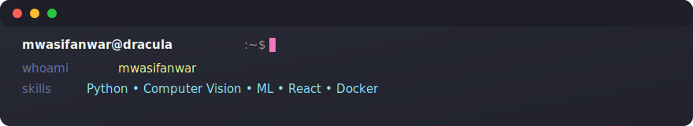

```markdown
<p align="center">
  <!-- Default: Dracula. To use Solarized Dark, change the filename below to ./assets/terminal-solarized.svg -->
  
</p>

<h1 align="center">Hi, I'm <strong>mwasifanwar</strong> 👋</h1>
<p align="center"><em>Machine Learning & Computer Vision • Full‑stack tinkerer • Building practical AI & web tools</em></p>

```bash
# welcome
mwasifanwar@devbox:~$ whoami
mwasifanwar

mwasifanwar@devbox:~$ role
• ML Engineer • Computer Vision • Full‑stack tinkerer

mwasifanwar@devbox:~$ skills
• Python  • Computer Vision  • Machine Learning  • Streamlit  • React  • JavaScript  • Docker

mwasifanwar@devbox:~$ featured_projects
# click links below to open in a new tab
• YOLO-v8-Football-Analytics
• KC-House-Price-Prediction
• GradeVision
• wiznemm
• VoiceWise-Agent

mwasifanwar@devbox:~$
```

Featured projects
- YOLO-v8-Football-Analytics — Track the players in a football game using deep learning  
  https://github.com/mwasifanwar/YOLO-v8-Football-Analytics

- KC-House-Price-Prediction — King County House Price Prediction Streamlit Web App  
  https://github.com/mwasifanwar/KC-House-Price-Prediction

- GradeVision — Automated grade evaluations using computer vision  
  https://github.com/mwasifanwar/GradeVision

- wiznemm — e-Portfolio ✨  
  https://github.com/mwasifanwar/wiznemm

- VoiceWise-Agent — voice/agent audio project  
  https://github.com/mwasifanwar/VoiceWise-Agent

Badges (optional)
- Top languages, stars, or GitHub stats can be added as badges. If you want them I can add a dynamic badges row (e.g., GitHub Readme Stats, Top languages, streaks).

Contact
- GitHub: https://github.com/mwasifanwar
- LinkedIn: UPDATE_ME
- Twitter: UPDATE_ME
- Website: UPDATE_ME

