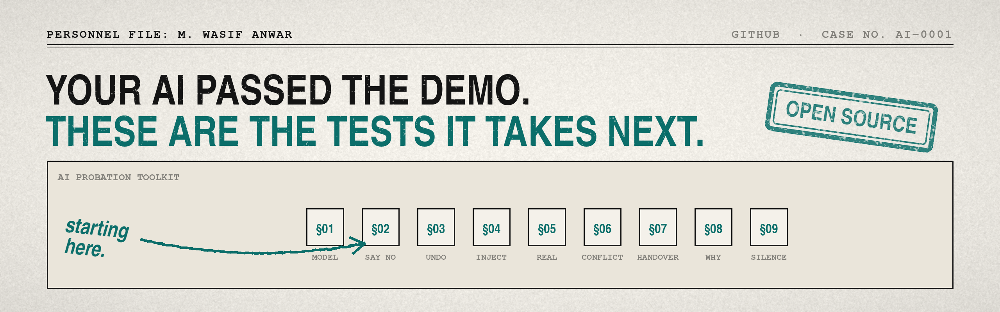

  

### Muhammad Wasif Anwar

AI engineer in Hannover, Germany. I build LLM applications, AI agents, voice AI and automation, and I care most about the part that comes after the demo: real users, messy data, and nobody watching.

Every AI I build gets a probation period. This profile is where the tests for that probation become open source.

---

### The AI Probation toolkit

Nine questions every AI agent should answer before it talks to customers alone, each turned into a small tool you can run on your own agent. One repo per question, plus one command that runs them all.

| | Question | Tool | Status |
|---|---|---|---|
| §01 | Can it change without anyone touching it? | `driftwatch` | planned |
| §02 | Can it say no, four times in a row? | `pushback` | **building now** |
| §03 | Are its permissions based on reversibility? | `undo-or-ask` | planned |
| §04 | Can a stranger rewrite its instructions? | `canary-docs` | planned |
| §05 | Was it tested on your customers, or on your team? | `ticket-replay` | planned |
| §06 | What happens when two documents disagree? | `kb-conflicts` | planned |
| §07 | Does the customer have to start over with a human? | `handover` | planned |
| §08 | Can you explain one answer from last Tuesday? | `why-ledger` | planned |
| §09 | Are you measuring resolution, or just silence? | `silence-audit` | planned |
| ✱ | All nine, one scorecard | `ai-probation` | planned |

Every tool ships with a real example run, tests, and a section called **Known limitations**. If a README claims something, the repo can show it.

Want to run the review by hand first? It takes five minutes: **[mwasif.dev/review](https://mwasif.dev/review)**

---

### How I work

1. I'll ask what should happen when the AI is wrong. Early. More than once.
2. I'd rather show you a failure in week one than hide it until month three.
3. "Small" is a hypothesis, not a measurement.
4. Every decision gets its reason written down.
5. If it can't be undone, a human approves it.

---

### Tools I work with

- **AI and LLMs:** LangChain, RAG, AI agents, model evaluation, PyTorch, TensorFlow
- **Voice and vision:** speech-to-text, text-to-speech, YOLOv8, OpenCV, OCR
- **Backend and data:** Python, FastAPI, Node.js, Express, PostgreSQL, MongoDB
- **Frontend and delivery:** TypeScript, React, Docker, CI/CD, AWS

---

### On file elsewhere

- **Website:** [mwasif.dev](https://mwasif.dev), the full personnel file, built like an HR archive
- **LinkedIn:** [in/mwasifanwar](https://www.linkedin.com/in/mwasifanwar), where I write about AI after the demo
- **Email:** [wasifsdk@gmail.com](mailto:wasifsdk@gmail.com)

> One of my AI agents once filed a formal complaint about me. HR took no action.  
> [Read the thread](https://mwasif.dev/#complaint)

End of file.

